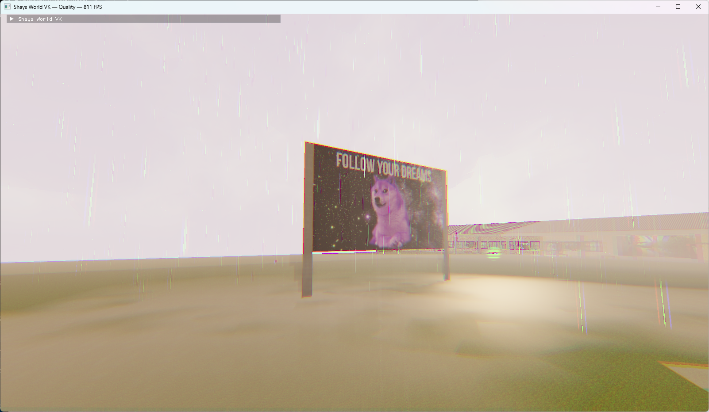
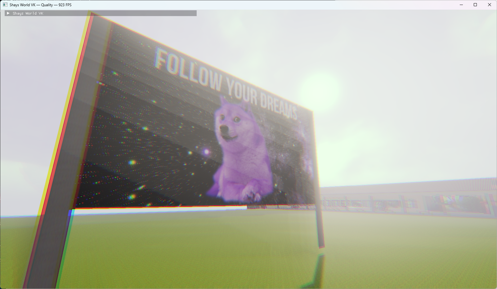

# Shays World VK

the ai sloppatron 5000 got some game i'll give it that. hats off to my boi grok4.5 for this AAAA slop





## AI Slop

A greenfield **C++20 + Vulkan** rewrite of Shay Leary’s 2005 Murdoch University campus tour — faithful geometry, modern renderer, and a ridiculous Performance preset.

| Preset | Goal |
|--------|------|
| **Performance** (F1) | All fancy FX off, bindless single-draw campus. Chase four-digit FPS. |
| **Quality** (F1) | PBR, CSM, GTAO, volumetric sky/clouds, day/night, lamps, rain, cooked post. |

Original GLUT / display-list sources are **not** linked at runtime. They remain a bake-time reference only.

## Requirements

- Windows x64 or Linux x86_64
- GPU + drivers with **Vulkan 1.2+** (descriptor indexing)
- [Vulkan SDK](https://vulkan.lunarg.com/) to build (needs `glslangValidator`)
- Linux build deps: X11 / Wayland GLFW deps (`libx11-dev`, `libxi-dev`, …)

## Quick start (players)

1. Download **shays-world-vk-windows.zip** or **shays-world-vk-linux-x86_64.zip** from [Releases](../../releases) or Actions artifacts.
2. Unzip and run `shays_vk.exe` (Windows) or `./shays_vk` (Linux).
3. See `CONTROLS.txt` in the zip.

Linux footsteps need `aplay` (alsa-utils) or `paplay` installed.

## Build from source

Windows:

```bat
cmake -S . -B build -G "Visual Studio 17 2022" -A x64
cmake --build build --config Release --target shays_vk
```

Linux:

```bash
sudo apt install build-essential cmake ninja-build pkg-config \
  libx11-dev libxi-dev libxcursor-dev libxinerama-dev libxrandr-dev \
  libxkbcommon-dev libwayland-dev wayland-protocols
cmake -S . -B build -G Ninja -DCMAKE_BUILD_TYPE=Release
cmake --build build --target shays_vk
```

The binary lands in the build output dir with `assets/` and `shaders/` copied beside it.

### Package a redistributable zip

```bat
cmake --build build --config Release --target package_release
```

Or:

```powershell
powershell -File scripts/package-release.ps1
```

Output: `build/dist/shays-world-vk-windows.zip` or `shays-world-vk-linux-x86_64.zip`

### GitHub Actions

Push to `main` / open a PR → Windows + Linux Release builds + zip artifacts.  
Tag `v*` → both zips attached to a GitHub Release.

## Controls

| Key | Action |
|-----|--------|
| WASD | Walk / fly |
| Mouse | Look |
| F1 | Performance ↔ Quality |
| F2 | Cursor capture |
| F3 | Free-fly |
| F4 | Hide HUD |
| R | Rain (Quality) |
| L | Force lamps (Quality) |
| Esc | Quit |

## Layout

```
modern/          (this repo)
  assets/        baked campus (scene.bin, textures, collision, sounds)
  shaders/       GLSL → SPIR-V at build time
  src/           runtime
  tools/         bake helpers
  scripts/       package-release
```

## Credits

- Original campus: **Shay Leary**, April 2005 — *Murdoch University Campus Tour*
- Vulkan port / renderer: this repository
